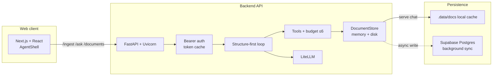
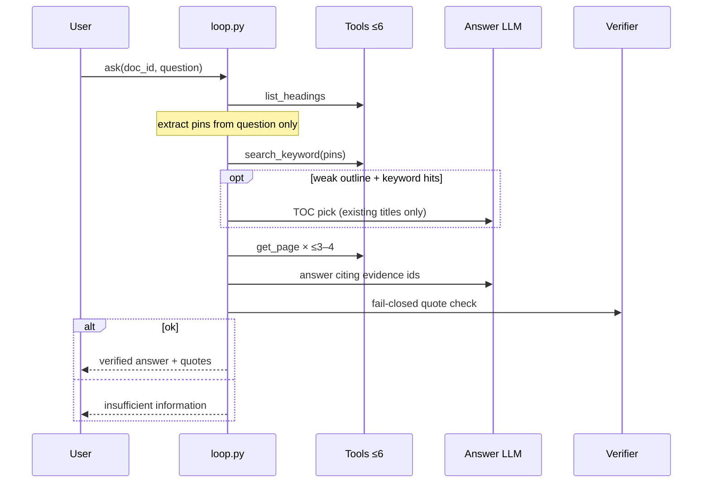
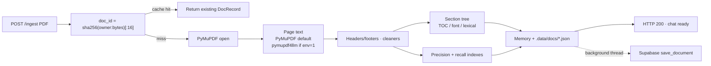
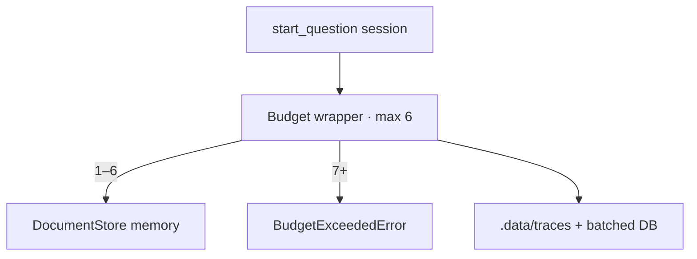

# SixCall — Budgeted Document-Answering Agent

Hackathon build: a **budgeted PDF Q&A agent** with a FastAPI backend and a Next.js demo UI.

Upload a PDF, ask questions from the Python API, CLI, or browser. Answers are constrained by **four document tools** and a hard **6 tool-call budget**. The agent **abstains** when quotes cannot be verified against fetched pages.

---

## Table of contents

1. [System overview](#system-overview)
2. [Technology stack](#technology-stack)
3. [Layered architecture](#layered-architecture)
4. [Agent loop](#agent-loop)
5. [Document ingest](#document-ingest)
6. [Tool / store boundary](#tool--store-boundary)
7. [Web UI](#web-ui)
8. [Auth & database](#auth--database)
9. [LLM routing](#llm-routing)
10. [Setup](#setup)
11. [API / CLI](#api--cli)
12. [Tests & failure modes](#tests--failure-modes)

---

## System overview



**Design rules**

- Chat reads **local memory / disk** after ingest — never waits on Supabase for page text.
- Postgres sync is **background only**; it does not replace the local catalog used for asks.
- Same owner + PDF bytes → same `doc_id` (idempotent; re-upload is a cache hit).

---

## Technology stack

| Area | Technology | Role |
| ---- | ---------- | ---- |
| **Web UI** | Next.js, React, TypeScript, Tailwind | Chat shell, upload, inline cite hover |
| **API** | FastAPI, Uvicorn, python-multipart | `/ingest`, `/ask`, `/documents`, auth |
| **PDF text** | **PyMuPDF** (default) | Fast page extract for large textbooks |
| **PDF markdown** | pymupdf4llm (opt-in) | `SIXCALL_MARKDOWN_EXTRACT=1` for tables |
| **Outline** | PyMuPDF TOC → fonts → lexical | Section tree at ingest |
| **Search** | Precision index + stemmed recall | Inside one `search_keyword` call |
| **Quote check** | Exact / fragment / RapidFuzz ≥90 | Digits + negations must match |
| **LLM** | LiteLLM → Groq / Gemini | TOC pick (optional) + answer |
| **DB** | Supabase Postgres (`psycopg`) | Users, sessions, async doc sync |
| **Local cache** | `.data/docs`, `.data/traces` | Source of truth for serving |

**Not used:** LangChain, LangGraph, LlamaIndex, vector RAG. Navigation is section tree + keyword pins + budgeted page reads.

---

## Layered architecture

The agent imports **only tool functions** (+ wrapper). It must not import `app.store` (`tests/test_no_store_leak.py`).

| Layer | Owns | Sees |
| ----- | ---- | ---- |
| **Store / tools** | Pages, headings, dual indexes | Full document |
| **Agent** | Pins → section match → rank → answer → verify | Tool returns for this question only |

### The four tools

| Tool | Returns | Used in `/ask`? |
| ---- | ------- | --------------- |
| `list_documents()` | Titles + metadata | **No** — HTTP catalog / discovery only |
| `list_headings(doc_id)` | Outline ranges | **Yes** (usually first call) |
| `search_keyword(doc_id, keyword\|pins)` | Ranked page numbers | **Yes** (one multi-pin call) |
| `get_page(doc_id, page)` | One page’s cleaned text | **Yes** (budgeted reads) |

`wrapper.py` logs every call and **refuses a 7th** for that `question_id`.

---

## Agent loop

Structure-first happy path (**no planner LLM** when heading titles already overlap the question):

```text
list_headings → question-only pins → search_keyword(pins)
  → choose_pages (section + co-occurrence) → get_page ×N → one answer → verify
```



**Typical budget:** `1×list_headings + 1×search_keyword + ≤4×get_page ≤ 6`.

Pins are substrings of the question (atoms before phrases). Ranking prefers pages where several pins co-occur, especially inside matched heading ranges. Contradiction-sensitive questions lock the latest keyword hit page.

Follow-ups that skip tools stay **off** (`SIXCALL_FOLLOWUPS=0`).

---

## Document ingest



| Setting | Default | Effect |
| ------- | ------- | ------ |
| `SIXCALL_MARKDOWN_EXTRACT` | `0` | Fast plain text; set `1` for markdown tables |
| `SIXCALL_OCR` | `0` | OCR only when explicitly enabled |
| `SIXCALL_USE_DB` | `auto` | Postgres when `DATABASE_URL` is set |

After local persist, the doc is **ready for chat immediately**. DB hydrate on startup is also background and **never overwrites** an existing local catalog.

---

## Tool / store boundary



Page bodies never leave the store except through `get_page`. Search returns integers only.

---

## Web UI

- Per-chat PDF binding (turns are chat-local; store docs can be shared by `doc_id`).
- **Used x/6 calls** collapsed by default.
- Quotes as **numbered cite chips**; hover shows excerpt + page (not a dumped quote list).
- No Continue / follow-up chip path.
- UI calls the API via `NEXT_PUBLIC_API_BASE` (e.g. `http://127.0.0.1:8002`) so long `/ingest` and `/ask` are not killed by a Next rewrite proxy.

---

## Auth & database

- Email/password sessions in Postgres when `DATABASE_URL` is set.
- Bearer tokens are **cached ~5 minutes** in process to avoid a remote round-trip on every ask/upload.
- Document **serving** stays local even after background sync completes.
- `DELETE /documents/{id}` is owner-scoped.
- Migrate explicitly: `python -m app.cli migrate` (API startup does not migrate).

---

## LLM routing

- Optional **TOC pick** (light model) only when section overlap is weak but keywords already hit pages.
- **Answer** uses the main model path; verify is local (no repair LLM by default).
- `LLM_PRIMARY=groq|gemini` with cross-fallback when configured.
- Bound by `REQUEST_DEADLINE_SEC` / attempt timeouts.

---

## Setup

```bash
cd SixCall
python -m venv .venv
# Windows
.\.venv\Scripts\activate
pip install -r requirements.txt
```

Copy `.env.example` → `.env`. **Never commit API keys.**

### API + UI

```bash
# terminal 1 — API
.\.venv\Scripts\activate
uvicorn app.server:app --host 127.0.0.1 --port 8002

# terminal 2 — UI (set NEXT_PUBLIC_API_BASE to match)
cd web
npm install
npm run dev
```

Open http://localhost:3000 → sign in (if DB configured) → upload PDF → ask.

### Fast vs rich extract

```bash
# Default — snappy uploads (recommended while iterating)
SIXCALL_MARKDOWN_EXTRACT=0

# Judging / table-heavy quality pass (~2–3 min on a 600-page PDF)
SIXCALL_MARKDOWN_EXTRACT=1
```

### Local-only store (no Postgres catalog)

```bash
SIXCALL_USE_DB=0
```

Auth still needs `DATABASE_URL` if you use signup/login.

---

## API / CLI

### Python

```python
from app import ingest_pdf, ask, list_docs, get_trace

doc_id = ingest_pdf("policy.pdf")
answer = ask(doc_id, "What is the refund window?")
print(answer.status, answer.text, answer.calls_used)
print(get_trace(answer.question_id))
```

`status`: `ok` | `insufficient_information`.

### CLI

```bash
SIXCALL_USE_DB=0 python -m app.cli ingest path/to/file.pdf
SIXCALL_USE_DB=0 python -m app.cli ask <doc_id> "What is the refund window?"
python -m app.cli trace <question_id>
python -m app.cli docs
python -m app.cli migrate
```

### HTTP (selected)

| Method | Path | Purpose |
| ------ | ---- | ------- |
| `POST` | `/auth/signup`, `/auth/login` | Account + token |
| `POST` | `/ingest` | Upload PDF → `doc_id` (local-ready) |
| `GET` | `/documents` | List owned docs |
| `DELETE` | `/documents/{doc_id}` | Delete one |
| `POST` | `/ask` | Budgeted Q&A |
| `GET` | `/health` | Liveness |

---

## Tests & failure modes

```bash
pytest -q
```

Covered: 7th call blocked · structure-first pins/sections · local-first ingest (DB sync non-blocking) · fabricated quotes rejected · empty search abstain · owner-scoped `doc_id` · no store import from agent.

### Hardened

- Unicode / PDF asterisks, ligatures, soft hyphens
- Tech tokens: `A*`, `C++`, `C#`
- Keyword aliases inside one `search_keyword` call
- Near-span verify: RapidFuzz ≥90 with same digits/negations

### Still possible

- Synonym miss (“termination” vs “halting”)
- Weak outline (no TOC + uniform fonts)
- OCR gaps when `SIXCALL_OCR=0`
- Multi-hop needs more than 6 calls → abstain
- Total LLM outage → insufficient information

### Dependencies

```
pymupdf, pymupdf4llm, litellm, python-dotenv, pydantic, rapidfuzz, snowballstemmer,
nltk, pytest, fastapi, uvicorn, python-multipart, psycopg
```

NLTK data is bundled under `app/nltk_data` (no runtime downloads).
