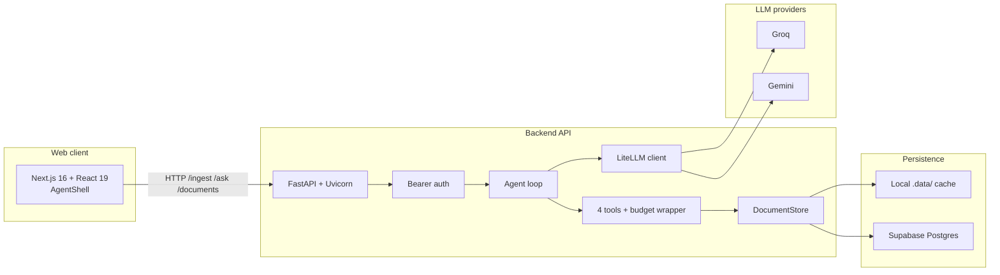
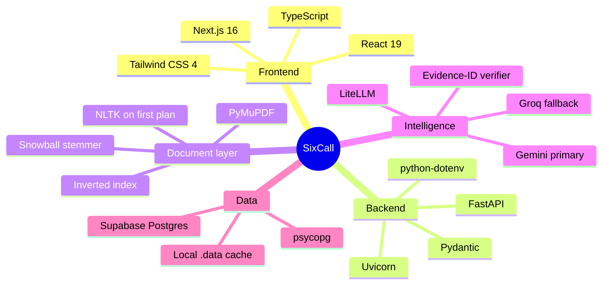
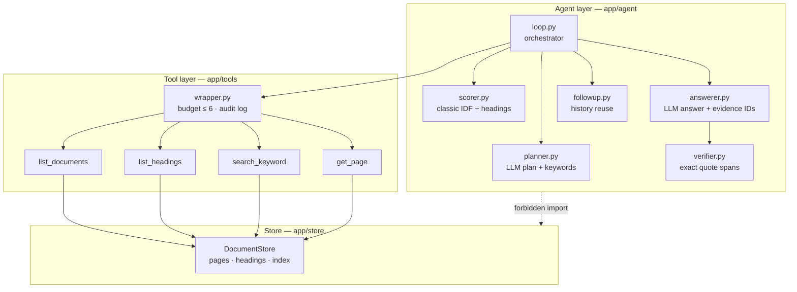
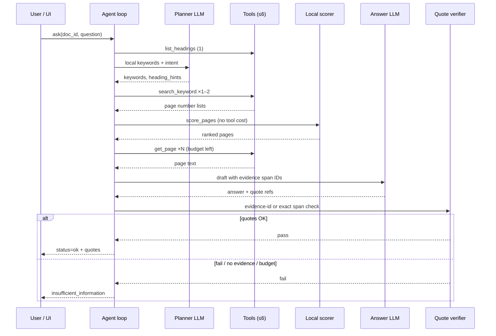
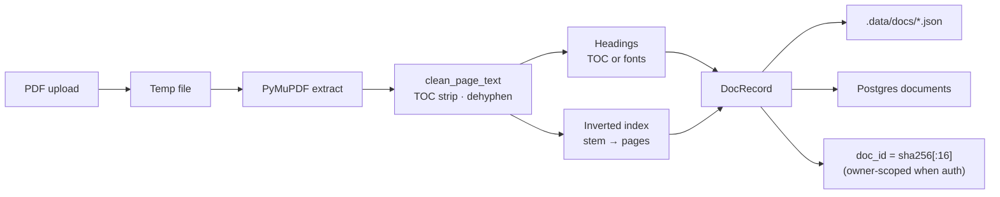
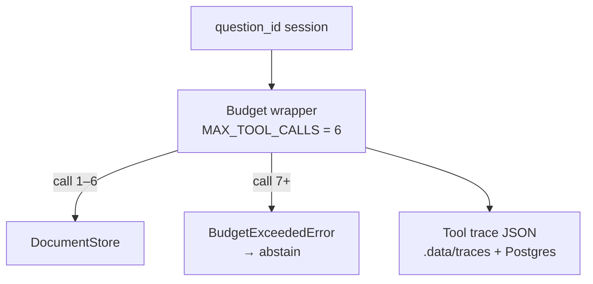
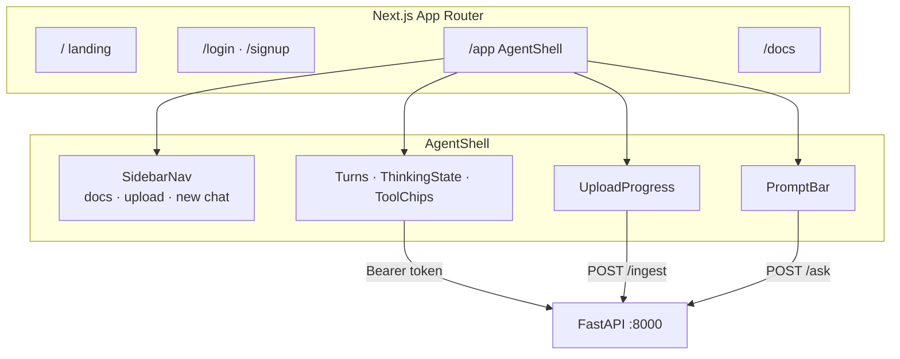
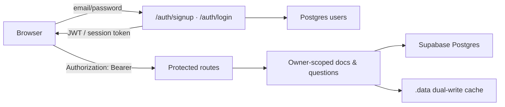
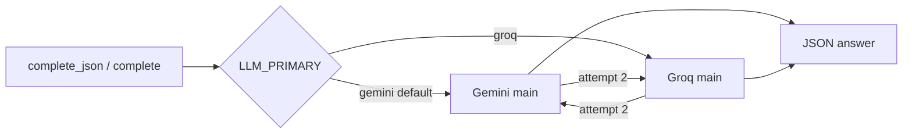

# SixCall — Budgeted Document-Answering Agent

Hackathon build: a **budgeted PDF Q&A agent** with a FastAPI backend and a Next.js demo UI.

Upload a PDF, ask questions from the Python API, CLI, or browser. Answers are constrained by **4 document tools** and a hard **6 tool-call budget**. The agent may **abstain** when quotes cannot be verified.

---

## Table of contents

1. [System overview](#system-overview)
2. [Technology stack](#technology-stack)
3. [Layered architecture](#layered-architecture)
4. [Agent loop](#agent-loop)
5. [Document ingest](#document-ingest)
6. [Tool / store boundary](#tool--store-boundary)
7. [Web UI](#web-ui)
8. [Auth & database](#auth--database)
9. [LLM routing](#llm-routing)
10. [Setup](#setup)
11. [API / CLI](#api--cli)
12. [Tests & failure modes](#tests--failure-modes)

---

## System overview

End-to-end path from browser → API → agent → tools → store → LLM → verified answer.



---

## Technology stack

| Area            | Technology                                       | Role in SixCall                          |
| --------------- | ------------------------------------------------ | ---------------------------------------- |
| **Web UI**      | Next.js 16, React 19, TypeScript, Tailwind CSS 4 | Chat shell, auth pages, upload / ask UX  |
| **API**         | FastAPI, Uvicorn, python-multipart               | REST: ingest, ask, documents, auth       |
| **Validation**  | Pydantic v2                                      | Request/response models                  |
| **Config**      | python-dotenv                                    | `.env` + optional private keys file      |
| **PDF parse**   | PyMuPDF (`pymupdf`)                              | Page text and TOC/font headings. OCR is off unless `SIXCALL_OCR=1` |
| **Search**      | Custom inverted index + Snowball stemmer         | Keyword → page numbers (not vectors)     |
| **NLP helpers** | NLTK (bundled `app/nltk_data`, imported on first plan) | Query keywords / stopwords only. Not used during ingest |
| **Quote check** | Evidence-ID membership, else exact span          | Verifier rejects unknown ids and paraphrases |
| **LLM gateway** | LiteLLM                                          | Gemini primary, Groq fallback (`LLM_MAX_ATTEMPTS` ≥ 2) |
| **Database**    | Supabase Postgres via `psycopg`                  | Docs, users, sessions, Q&A, traces       |
| **Local cache** | `.data/docs`, `.data/traces`                     | Fast local store; dual-write when DB set |
| **Tests**       | pytest                                           | Budget, verifier, store isolation, NLP   |

**Explicitly not used:** embeddings, vector DBs, LangChain / LangGraph / LlamaIndex agent frameworks.



---

## Layered architecture

Two layers, enforced in code. The agent package imports **only the four tool functions** (+ wrapper helpers). It must **not** import `app.store` (see `tests/test_no_store_leak.py`).

| Layer                                       | Owns                                                    | Sees                                             |
| ------------------------------------------- | ------------------------------------------------------- | ------------------------------------------------ |
| **Tool / store** (`app/store`, `app/tools`) | Parsed pages, headings, keyword index                   | Full document data                               |
| **Agent** (`app/agent`)                     | Planner → search → score → `get_page` → answer → verify | Only tool return values for the current question |



### The only 4 tools

1. `list_documents()` — titles + metadata
2. `list_headings(doc_id)` — TOC / headings
3. `get_page(doc_id, page_number)` — text of **exactly one** page
4. `search_keyword(doc_id, keyword)` — **page numbers only**

`app/tools/wrapper.py` logs every call and **refuses a 7th** tool call for that `question_id`, forcing decline / insufficient information.

### Why keyword inverted lookup ≠ vector search

At ingest we build a **keyword inverted map** (`stem → sorted page numbers`) so `search_keyword` can return page hits quickly. That is classic exact/phrase lookup over pages already in the store — not embeddings, not a vector database. Page selection after search uses **classic keyword IDF on the page numbers tools already returned**, plus heading-range boosts.

---

## Agent loop

Per-question flow (budgeted). Planning is local unless `SIXCALL_LLM_PLANNER=1`, so the happy path is one answer-model call (two if that flag is on). A repair re-draft is the only extra answer call. Follow-ups that skip tools are off unless `SIXCALL_FOLLOWUPS=1`.



**Steps (typical):**

1. `list_headings` (1 call)
2. Local planner (no network): keywords, intent, contradiction flag
3. `search_keyword` ×1–2
4. Local scorer (no tool): keyword IDF + heading boost. If the question is contradiction-sensitive, `max(keyword hits)` is placed first **before** heading pages are appended
5. `get_page` for up to 3 pages, or up to 4 for multi / compare / supersede, holding one call back for repair when more candidates remain
6. One answer call on the **main** model (Gemini, then Groq if that attempt fails)
7. Verifier: evidence id must be one of the spans from the fetched pages; otherwise the quote must be an exact span
8. If the draft abstains or verification fails and a call remains, one repair `get_page` and one more answer call

Page text is **untrusted data**. Injection-like lines are flagged; the system prompt answers the **user** question only.

---

## Document ingest



- Display name = **uploaded filename** (not temp path stem).
- Same bytes (+ owner) → same `doc_id` (idempotent ingest).
- OCR is **off by default** (`SIXCALL_OCR=0`). Turn it on only for scanned pages; Tesseract is what makes upload feel slow.
- The CLI sets `SIXCALL_USE_DB=0`, so a demo does not open Postgres. The API still dual-writes when `DATABASE_URL` is set and `SIXCALL_USE_DB` is not `0`.

---

## Tool / store boundary



| Tool             | Returns                 | Burns budget                  |
| ---------------- | ----------------------- | ----------------------------- |
| `list_documents` | Doc metadata list       | Yes                           |
| `list_headings`  | Heading tree / ranges   | Yes                           |
| `search_keyword` | `list[int]` page hits   | Yes (aliases inside one call) |
| `get_page`       | One page’s cleaned text | Yes                           |

---

## Web UI



Run separately from the API (UI talks to `http://127.0.0.1:8000` directly so long `/ask` requests are not killed by a Next rewrite proxy).

---

## Auth & database



- Set `DATABASE_URL` (Session pooler, `sslmode=require`, percent-encode passwords).
- Apply schema **explicitly**: `python -m app.cli migrate` (API startup does **not** migrate).
- Prefer **dev** branch for writes — never auto-migrate production/`main`.
- `DELETE /documents` clears only the signed-in user’s files when auth is on.

---

## LLM routing



- Keyword planning is **local** (`SIXCALL_LLM_PLANNER=0`). That removes a model round-trip from every question.
- The final answer uses the **main** model, not the light model, with `LLM_MAX_ATTEMPTS` defaulting to 2 so Groq is a real fallback.
- `REQUEST_DEADLINE_SEC` defaults to 28 so one slow answer plus one fallback can finish. A successful first call returns immediately and does not wait out the deadline.
- Total provider failure → `insufficient_information`.

### Latency (measured here, no API keys)

These are structure timings on a 12-page text PDF and a 3-page amendment sample. Provider time is not included.

| Step | Before | After |
| --- | --- | --- |
| Import `app.api` | 0.25s (NLTK loaded) | 0.09s (NLTK not loaded yet) |
| Ingest 12-page text PDF | 0.016s | 0.016s |
| Sparse one-word page | 0.014s (OCR attempted; Tesseract absent, failed in ~8ms) | 0.001s (OCR not called) |
| `search_keyword` | 0.01ms | 0.01ms |
| Ask with the answer model mocked | 0.05s, and the scrubber had already deleted words such as "create" and "ate" | ~0.04s cold, ~0.003s warm. Latest amendment page is in `pages_used` |

The inverted index stays under a millisecond. Upload time grows when OCR runs on every thin page, so OCR is off unless `SIXCALL_OCR=1`. Query time was a planner round-trip plus a light answer call, often cut off by the old 15s deadline. The happy path is local planning plus one main-model answer, and that call returns as soon as it succeeds. Set both `GEMINI_API_KEY` and `GROQ_API_KEY` so the second attempt can run. A live Gemini call still has to fit the demo; this repo cannot time that without keys.

---

## Setup

```bash
cd C:\Users\thahs\Projects\SixCall
python -m venv .venv
.\.venv\Scripts\activate
pip install -r requirements.txt
```

Keys: copy `.env.example` → `.env`, or keep using your private file  
`C:\Users\thahs\Documents\RAP_LLM_KEYS.env` (auto-loaded when present).

**Never commit API keys.**

### Web UI + API

```bash
# terminal 1 — API (prefer no --reload during demos; reload can kill in-flight /ask)
.\.venv\Scripts\activate
uvicorn app.server:app --port 8000

# terminal 2 — UI
cd web
npm install
npm run dev
```

Open http://localhost:3000 — sign up / log in when `DATABASE_URL` is set, upload a PDF, ask questions.

### Database

```bash
python -m app.cli migrate
```

---

## API / CLI

### Python API

```python
from app import ingest_pdf, ask, list_docs, get_trace

doc_id = ingest_pdf("policy.pdf")
answer = ask(doc_id, "What is the refund window?")
print(answer.status, answer.text, answer.calls_used)
print(get_trace(answer.question_id))
```

`Answer`: `{text, status, pages_used, tool_trace, calls_used, question_id, quotes, ...}`  
`status` is `ok` or `insufficient_information`.

### CLI

```bash
python -m app.cli ingest path\to\file.pdf
python -m app.cli ask <doc_id> "What is AI?"
python -m app.cli docs
python -m app.cli migrate
```

### HTTP (selected)

| Method   | Path                          | Purpose                                    |
| -------- | ----------------------------- | ------------------------------------------ |
| `POST`   | `/auth/signup`, `/auth/login` | Account + token                            |
| `POST`   | `/ingest`                     | Upload PDF                                 |
| `GET`    | `/documents`                  | List owned docs                            |
| `DELETE` | `/documents/{doc_id}`         | Delete one doc                             |
| `POST`   | `/ask`                        | Ask (optional chat history for follow-ups) |
| `GET`    | `/health`                     | Liveness + DB flag                         |

---

## Tests & failure modes

```bash
pytest -q
```

Covered: 7th call blocked · `search_keyword` returns ints · agent does not import store · fabricated quotes rejected · empty search → insufficient information · stable `doc_id` for same bytes · follow-ups · query NLP.

### Hardened (common silent misses)

- Unicode / PDF asterisks (`A∗` vs `A*`), ligatures (`fi`), soft hyphens, NBSP, fancy dashes
- Tech tokens: `A*`, `C++`, `C#`, `O(n…)`
- Keyword aliases expanded _inside_ `search_keyword` (no extra tool-call budget)
- OCR also triggered on CID/`U+FFFD` garbage pages
- Extract flags dissolve ligatures + dehyphenate; inline TOC strip before hyphen joins

### Still possible

- **True synonym miss**: PDF says “termination”, query says “halting”
- **Weak structure**: no TOC + uniform fonts → thin heading hints
- **OCR gaps**: off by default; scans need `SIXCALL_OCR=1` and Tesseract
- **Budget**: multi-hop needing many pages under a 6-call cap → abstain
- **LLM outage**: Gemini↔Groq fallback; total failure → insufficient information

### Dependencies

```
pymupdf, litellm, python-dotenv, pydantic, snowballstemmer,
nltk, pytest, fastapi, uvicorn, python-multipart, psycopg
```

`rapidfuzz` is not used. Quote checks are evidence-ID membership or an exact span, not fuzzy match.

Query planning uses NLTK `word_tokenize(..., preserve_line=True)` and English stopwords from bundled `app/nltk_data` (no runtime downloads). Technical tokens and meaning-changing words (`not`, `before`, `after`) are preserved. Include `app/nltk_data` when packaging.
